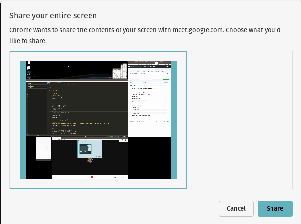

# Google Meet Screen Share Workaround

When I'm using multiple monitors and Google Meet and I am often plagued by [this bug](https://bugs.chromium.org/p/chromium/issues/detail?id=437507).
Sometimes I just want to share one of my displays but Chrome/Firefox/Chromium insist on sharing all of my displays at once like so:



Inspired by [this workaround](https://unix.stackexchange.com/questions/152435/sharing-your-desktop-with-google-hangouts-dual-monitor-and-gnome-shell) I wrote a script to make it easier to set this up - I often use different monitor setups so I wanted a "once size fits all" solution.

I'm running on Pop!\_OS 19.10, but this should work on Ubuntu as well

## Dependencies

- VLC is needed for the workaround:
  - Install with: `sudo apt install vlc vlc-plugin-access-extra`
- Python 3 is also required
- `xrandr` is used to detect displays and their arrangement

## Usage

This solution uses `python3`. No external libraries needed.

To print a list of all options:

```bash
./vlc-screen --help
```

Then select the screen you want to share:

```
./vlc-screen --primary
```

Now in Google Meet you can choose to share the VLC window
